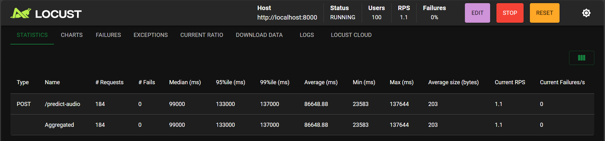

# Hip-Hop Era Classification ML Pipeline
## Project Overview

This project implements an end-to-end Machine Learning pipeline that classifies any hip-hop track into one of two eras:

Trap Rise

Modern

The solution covers the entire ML lifecycle:

Data acquisition from the FMA (Free Music Archive)

Audio feature extraction (MFCCs, tempo, chroma, spectral features)

Model training and evaluation (Random Forest and LightGBM with early stopping)

Best-model selection using log-loss optimization

API deployment for real-time predictions

Web UI dashboard for monitoring, predictions and retraining

Retraining workflow triggered by uploaded data

Load / stress testing using Locust with detailed results

Containerization and cloud deployment capability

## Repository Link

GitHub Repository:
(https://github.com/lemwaizz/MLPipeline_hiphop.git)

## Video Demonstration

YouTube Demo:
(https://youtu.be/-RtwLH0iTb0)

## Live Deployment URL

Web Application / Streamlit / API (if deployed):
(https://lemwaizz-mlpipeline-hiphop-streamlit-ui-gkweyd.streamlit.app/)

## Architecture Summary

The project contains five major components:

Component	Technology
Notebook for research + model development	JupyterLab / Colab
Model serving API	FastAPI
Retraining triggers	FastAPI endpoints
User interface	Streamlit dashboard
Load testing	Locust
## Directory Structure
Project/
│
├── README.md
├── requirements.txt
│
├── notebook/
│   └── project_name.ipynb
│
├── src/
│   ├── preprocessing.py
│   ├── model.py
│   ├── prediction.py
│   └── api.py
│
├── streamlit_ui.py
├── locustfile.py
│
├── data/
│   ├── raw/
│   ├── train/
│   ├── test/
│   └── processed/
│
└── models/
    ├── hiphop_era_classifier.pkl
    ├── scaler.pkl
    ├── label_encoder.pkl
    └── model_metadata.pkl

## Setup Instructions
1. Clone the Repository
git clone (https://github.com/lemwaizz/MLPipeline_hiphop.git)
cd Project

2. Create and Activate Virtual Environment
python -m venv venv
venv\Scripts\activate       (Windows)
source venv/bin/activate     (Mac/Linux)

3. Install Requirements
pip install --upgrade pip
pip install -r requirements.txt

4. Preprocess Data (only required if data/processed/ is missing)
python -c "from src.preprocessing import save_processed_features; save_processed_features()"

5. Train the Model (if model files are missing)
python -c "from src.model import train_best_model; train_best_model()"

6. Start API
uvicorn src.api:app --host 0.0.0.0 --port 8000 --reload

7. Start Web UI

Run in a new terminal:

streamlit run streamlit_ui.py

The UI provides:

Model uptime monitoring

Data visualizations

Audio upload for live prediction

CSV upload for retraining

Retraining trigger button

## How to Trigger Retraining

Upload a CSV containing new labeled audio feature rows (same structure as train_features.csv)

Press the "Trigger Retrain" button in the Streamlit UI

The model retrains and overwrites models/hiphop_era_classifier.pkl

## Flood Request Simulation (Locust Results)

Locust was used to simulate heavy traffic to the prediction endpoint (/predict-audio).

Test parameters:

Setting	Value
Endpoint tested	POST /predict-audio
Payload	Random MP3 samples from test dataset
Load	100 virtual users
Spawn rate	1 users per second
### Summary of Results

## Technology Stack

Python

Librosa

Scikit-Learn

LightGBM

FastAPI

Uvicorn

Streamlit

MongoDB (optional for retraining storage)

Docker

Locust